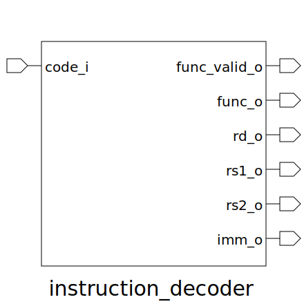

# instruction_decoder (module)

### Author : 

## TOP IO

## Description

## Parameters
|Name|Type|Dimension|Default Value|Description|
|-|-|-|-|-|

## Ports
|Name|Direction|Type|Dimension|Description|
|-|-|-|-|-|
|code_i|input|logic [ ILEN-1:0]|||
|func_valid_o|output|logic|||
|func_o|output|func_t|||
|rd_o|output|logic [REG_ADDR_WIDTH-1:0]|||
|rs1_o|output|logic [REG_ADDR_WIDTH-1:0]|||
|rs2_o|output|logic [REG_ADDR_WIDTH-1:0]|||
|imm_o|output|logic [ XLEN-1:0]|||
