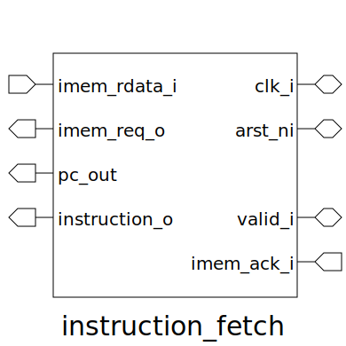

# instruction_fetch (module)

### Author : Md Abdullah Al Samad (mdsam.raian@gmail.com)

## TOP IO

## Description

Write a markdown documentation for this systemverilog module:

## Parameters
|Name|Type|Dimension|Default Value|Description|
|-|-|-|-|-|

## Ports
|Name|Direction|Type|Dimension|Description|
|-|-|-|-|-|
|clk_i|interface|input|||
|arst_ni|interface|input|||
|valid_i|interface|input|||
|imem_ack_i|input|logic|||
|imem_rdata_i|input|logic [DATA_WIDTH-1:0]|||
|imem_req_o|output|logic|||
|pc_out|output|logic [ADDR_WIDTH-1:0]|||
|instruction_o|output|logic [DATA_WIDTH-1:0]|||
