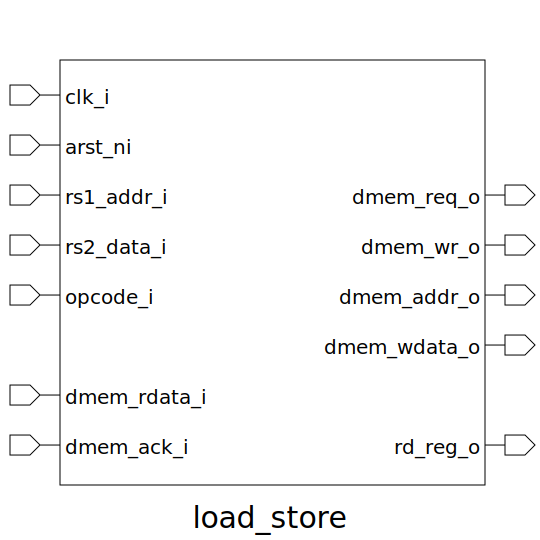

# load_store (module)

### Author : Md Abdullah Al Samad (mdsam.raian@gmail.com)

## TOP IO

## Description

Write a markdown documentation for this systemverilog module:

## Parameters
|Name|Type|Dimension|Default Value|Description|
|-|-|-|-|-|

## Ports
|Name|Direction|Type|Dimension|Description|
|-|-|-|-|-|
|clk_i|input|logic||Clock input|
|arst_ni|input|logic||Asynchronous reset, active low|
|rs1_addr_i|input|logic [DATA_WIDTH-1:0]||Address input from register source 1|
|rs2_data_i|input|logic [DATA_WIDTH-1:0]||Data input from register source 2|
|opcode_i|input|func_t||Opcode input to specify load or store operation|
|dmem_req_o|output|logic||Data memory request signal|
|dmem_wr_o|output|logic||Data memory write enable signal|
|dmem_addr_o|output|logic [ADDR_WIDTH-1:0]||Data memory address output|
|dmem_wdata_o|output|logic [DATA_WIDTH-1:0]||Data memory write data output|
|dmem_rdata_i|input|logic [DATA_WIDTH-1:0]||Data memory read data input|
|dmem_ack_i|input|logic||Data memory acknowledgment signal|
|rd_reg_o|output|logic [DATA_WIDTH-1:0]||Data output to register destination|
