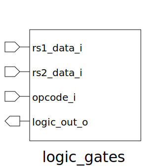

# logic_gates (module)

### Author : Md Abdullah Al Samad (mdsam.raian@gmail.com)

## TOP IO

## Description

Write a markdown documentation for this systemverilog module:

## Parameters
|Name|Type|Dimension|Default Value|Description|
|-|-|-|-|-|

## Ports
|Name|Direction|Type|Dimension|Description|
|-|-|-|-|-|
|rs1_data_i|input|logic [DATA_WIDTH-1:0]||Input data 1|
|rs2_data_i|input|logic [DATA_WIDTH-1:0]||Input data 2|
|opcode_i|input|func_t||Operation code|
|logic_out_o|output|logic [DATA_WIDTH-1:0]||Output data|
