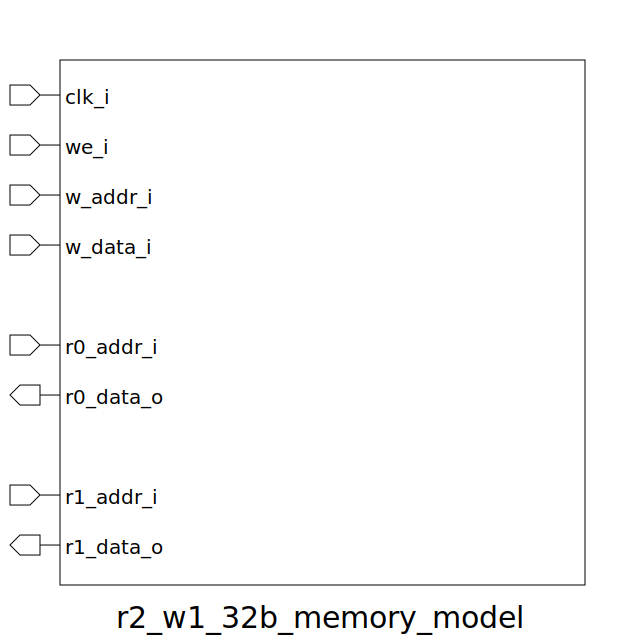

# r2_w1_32b_memory_model (module)

### Author : Foez Ahmed (foez.official@gmail.com)

## TOP IO

## Description

This module represents a simple 32-bit memory model with read and write ports. It is designed to be
used with a processor or other digital system. The module contains an internal memory array `mem`,
which is an 8-bit wide array indexed by the address. The memory array stores 4Byte data written to
it and provides 4 Byte data for read operations.

## Parameters
|Name|Type|Dimension|Default Value|Description|
|-|-|-|-|-|

## Ports
|Name|Direction|Type|Dimension|Description|
|-|-|-|-|-|
|clk_i|input|logic||Clock input|
|we_i|input|logic||Write enable input|
|w_addr_i|input|logic [ADDR_WIDTH-1:0]||Write address input|
|w_data_i|input|logic [DATA_WIDTH-1:0]||Write data input|
|r0_addr_i|input|logic [ADDR_WIDTH-1:0]||Read port 0 address input|
|r0_data_o|output|logic [DATA_WIDTH-1:0]||Read port 0 data output|
|r1_addr_i|input|logic [ADDR_WIDTH-1:0]||Read port 1 address input|
|r1_data_o|output|logic [DATA_WIDTH-1:0]||Read port 1 data output|
