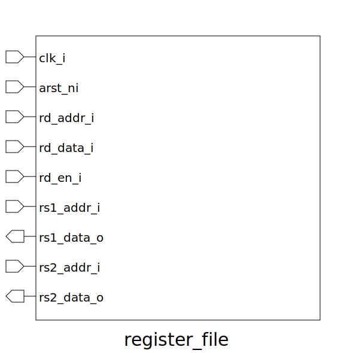

# register_file (module)

### Author : Md Abdullah Al Samad (mdsam.raian@gmail.com)

## TOP IO

## Description

Register file for the processor

## Parameters
|Name|Type|Dimension|Default Value|Description|
|-|-|-|-|-|

## Ports
|Name|Direction|Type|Dimension|Description|
|-|-|-|-|-|
|clk_i|input|logic||Global clock|
|arst_ni|input|logic||asynchronous active low reset|
|rd_addr_i|input|logic [REG_ADDR_WIDTH-1:0]||address for destination register|
|rd_data_i|input|logic [ XLEN-1:0]||data for destination register|
|rd_en_i|input|logic||destination register enable|
|rs1_addr_i|input|logic [REG_ADDR_WIDTH-1:0]||data address for rs1|
|rs1_data_o|output|logic [ XLEN-1:0]||read data for rs1|
|rs2_addr_i|input|logic [REG_ADDR_WIDTH-1:0]||data address for rs2|
|rs2_data_o|output|logic [ XLEN-1:0]||read data for rs2|
