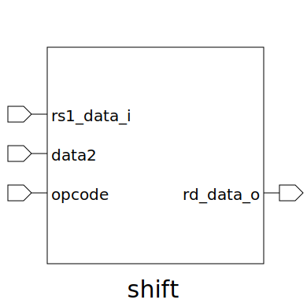

# shift (module)

### Author : 

## TOP IO

## Description

## Parameters
|Name|Type|Dimension|Default Value|Description|
|-|-|-|-|-|

## Ports
|Name|Direction|Type|Dimension|Description|
|-|-|-|-|-|
|rs1_data_i|input|logic [2:0]|||
|data2|input|logic [5:0]|||
|opcode|input|func_t|||
|rd_data_o|output|logic [2:0]|||
