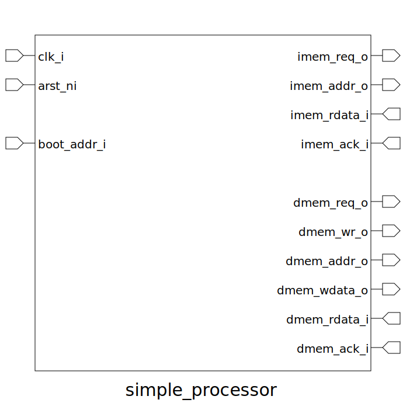

# simple_processor (module)

### Author : name (email)

## TOP IO

## Description

Write a markdown documentation for this systemverilog module:

## Parameters
|Name|Type|Dimension|Default Value|Description|
|-|-|-|-|-|
|MEM_ADDR_WIDTH|int||32|With of memory address bus|
|MEM_DATA_WIDTH|int||32|With of memory data bus|

## Ports
|Name|Direction|Type|Dimension|Description|
|-|-|-|-|-|
|clk_i|input|logic|| Global Synchronous Clock|
|arst_ni|input|logic|| Active low asynchronous reset|
|boot_addr_i|input|logic [MEM_ADDR_WIDTH-1:0]|| Boot address of the processor|
|imem_req_o|output|logic|| Signifies there is active request for memory at address imem_addr_o|
|imem_addr_o|output|logic [MEM_ADDR_WIDTH-1:0]|| Instruction address bus|
|imem_rdata_i|input|logic [MEM_DATA_WIDTH-1:0]|| Instruction data bus|
|imem_ack_i|input|logic|| Signifies instruction request is completed|
|dmem_req_o|output|logic|| Signifies there is active request for memory at address dmem_addr_o|
|dmem_addr_o|output|logic [MEM_ADDR_WIDTH-1:0]|| Data address bus|
|dmem_wdata_o|output|logic [MEM_DATA_WIDTH-1:0]|| Write data bus|
|dmem_rdata_i|input|logic [MEM_DATA_WIDTH-1:0]|| Read data bus|
|dmem_ack_i|input|logic|| Signifies data request is completed|
