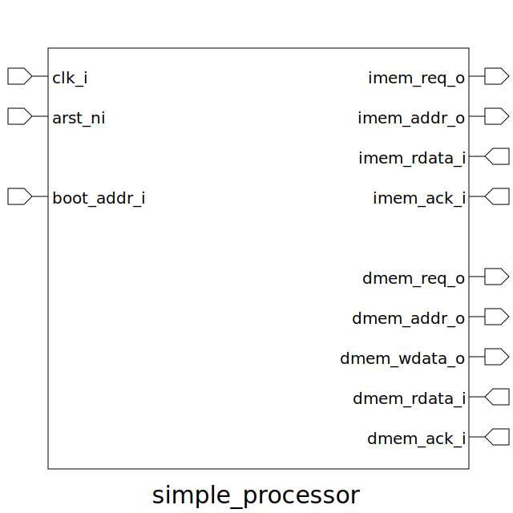

# Project Specification
Design a simple processor that performs some simple arithmetic & logical operations and also perform load & store operations from memory.

## System Architecture

### Key Parameters
|Parameter                 |Value|
|--------------------------|-----|
|Instruction Width         |16b  |
|Data Width                |32b  |
|Number of Registers       |8    |

### Registers
|Register Name|Register Address|Reset Value|Description             |
|-------------|----------------|-----------|------------------------|
|ZERO         |0x0             |0x0000     |Hardwired to Zero       |
|X1           |0x1             |0x0000     |General Purpose Register|
|X2           |0x2             |0x0000     |General Purpose Register|
|X3           |0x3             |0x0000     |General Purpose Register|
|X4           |0x4             |0x0000     |General Purpose Register|
|X5           |0x5             |0x0000     |General Purpose Register|
|X6           |0x6             |0x0000     |General Purpose Register|
|X7           |0x7             |0x0000     |General Purpose Register|

### Instruction Set Architecture (ISA)
|Instruction|Description                                                                                                                                    |Assembly            |Pseudocode       |
|-----------|-----------------------------------------------------------------------------------------------------------------------------------------------|--------------------|-----------------|
|**ADDI**   |Adds the value from Source Register 1 (RS1) and an Immediate Value (IMM), and stores the result in Destination Register (RD).                  |`ADDI   RD  RS1 IMM`|`RD = RS1 + IMM` |
|**ADD**    |Adds the value from Source Register 1 (RS1) and Source Register 2 (RS2), and stores the result in Destination Register (RD).                   |`ADD    RD  RS1 RS2`|`RD = RS1 + RS2` |
|**SUB**    |Subtracts the value of Source Register 2 (RS2) from Source Register 1 (RS1), and stores the result in Destination Register (RD).               |`SUB    RD  RS1 RS2`|`RD = RS1 - RS2` |
|**AND**    |ANDs the value from Source Register 1 (RS1) and Source Register 2 (RS2), and stores the result in Destination Register (RD).                   |`AND    RD  RS1 RS2`|`RD = RS1 & RS2` |
|**OR**     |ORs the value from Source Register 1 (RS1) and Source Register 2 (RS2), and stores the result in Destination Register (RD).                    |`OR     RD  RS1 RS2`|`RD = RS1 \| RS2`|
|**XOR**    |XORs the value from Source Register 1 (RS1) and Source Register 2 (RS2), and stores the result in Destination Register (RD).                   |`XOR    RD  RS1 RS2`|`RD = RS1 ^ RS2` |
|**NOT**    |Inverts the value from Source Register 1 (RS1), and stores the result in Destination Register (RD).                                            |`NOT    RD  RS1`    |`RD = ~RS1`      |
|**LOAD**   |Loads 32b value from memory at byte address set on Source Register 1, and stores it on Destination Register (RD).                              |`LOAD   RD  RS1`    |`RD = mem[RS1]`  |
|**STORE**  |Stores the 32b value from Source Register 2 (RS2) in memory at byte address in Source Register 1 (RS1).                                        |`STORE  RS2 RS1`    |`mem[RS1] = RS2` |
|**SLL**    |Left shift the value from Source Register 1 (RS1) by the amount from Source Register (RS2), and store the result in Destination Register (RD). |`SLL    RD  RS1 RS2`|`RD = RS1 >> RS2`|
|**SLR**    |Right shift the value from Source Register 1 (RS1) by the amount from Source Register (RS2), and store the result in Destination Register (RD).|`SLR    RD  RS1 RS2`|`RD = RS1 << RS2`|
|**SLLI**   |Left shift the value from Source Register 1 (RS1) by the amount from Immediate Value (IMM), and store the result in Destination Register (RD). |`SLLI   RD  RS1 IMM`|`RD = RS1 >> IMM`|
|**SLRI**   |Right shift the value from Source Register 1 (RS1) by the amount from Immediate Value (IMM), and store the result in Destination Register (RD).|`SLRI   RD  RS1 IMM`|`RD = RS1 << IMM`|

### Instruction Encoding
The following diagram shows different field within the instruction along with their encoding.


### Asembly code vs. Machine code Example
<table>
<tr>
<td>

```
ADDI X1 X3 0b100111
NOT  X7 X2
XOR  X3 X4 X5
```

</td>

<td>

```
001 011 100111 0001
111 010 000000 0111
011 100 101000 1111
```

</td>
</tr>
</table>

## Top Level IOs



### Parameters
|Name|Type|Dimension|Default Value|Description|
|-|-|-|-|-|
|MEM_ADDR_WIDTH|int||32|With of memory address bus|
|MEM_DATA_WIDTH|int||32|With of memory data bus|

## Ports
|Name|Direction|Type|Dimension|Description|
|-|-|-|-|-|
|clk_i|input|logic|| Global Synchronous Clock|
|arst_ni|input|logic|| Active low asynchronous reset|
|boot_addr_i|input|logic [MEM_ADDR_WIDTH-1:0]|| Boot address of the processor|
|imem_req_o|output|logic|| Signifies there is active request for memory at address imem_addr_o|
|imem_addr_o|output|logic [MEM_ADDR_WIDTH-1:0]|| Instruction address bus|
|imem_rdata_i|input|logic [MEM_DATA_WIDTH-1:0]|| Instruction data bus|
|imem_ack_i|input|logic|| Signifies instruction request is completed|
|dmem_req_o|output|logic|| Signifies there is active request for memory at address dmem_addr_o|
|dmem_wr_o|output|logic|| Signifies the request is write, otherwise read|
|dmem_addr_o|output|logic [MEM_ADDR_WIDTH-1:0]|| Data address bus|
|dmem_wdata_o|output|logic [MEM_DATA_WIDTH-1:0]|| Write data bus|
|dmem_rdata_i|input|logic [MEM_DATA_WIDTH-1:0]|| Read data bus|
|dmem_ack_i|input|logic|| Signifies data request is completed|

<br>
<br>
<br>

## TODOs
  - Propose Architecture
  - Bringup Assembly code to Machine code converter in python
  - Design & Verify Submodules
  - Bringup top module
  - Propose Test Architecture
  - Run assembly tests

# `PLEASE NOTE`
- **This is a team project, so co-ordinate accordingly**
- **At the repo root, type `make help` to see how things work**
- **Please use 2 space for indentation**
- **Do not use tab for indentation**
